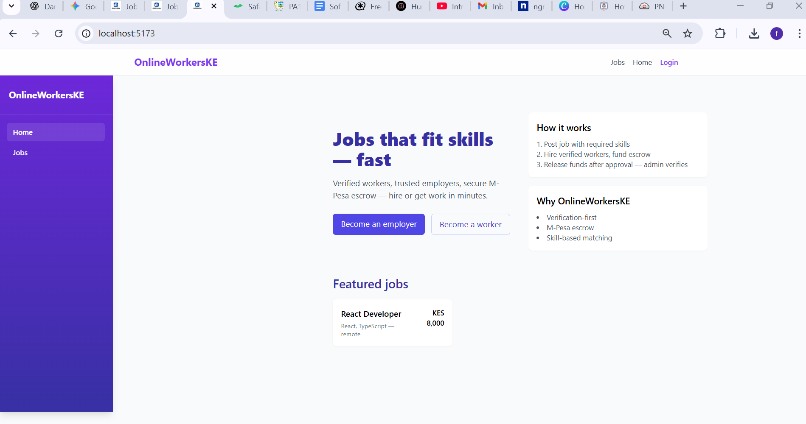
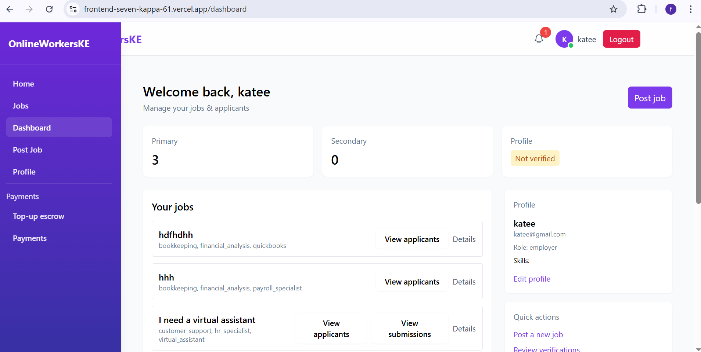
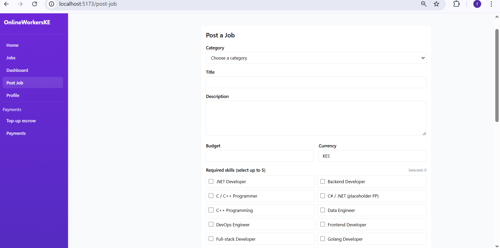
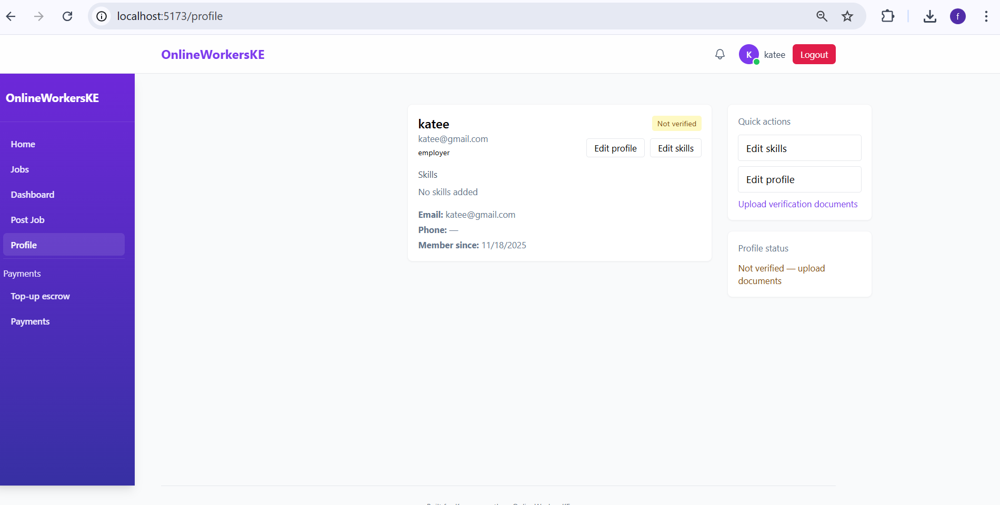
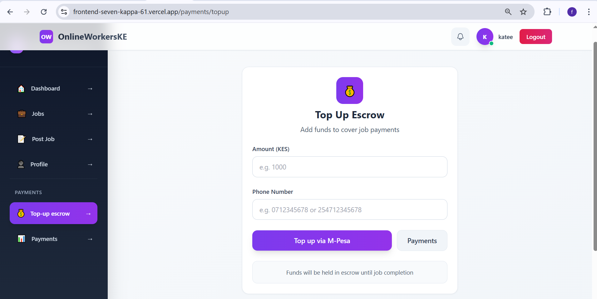
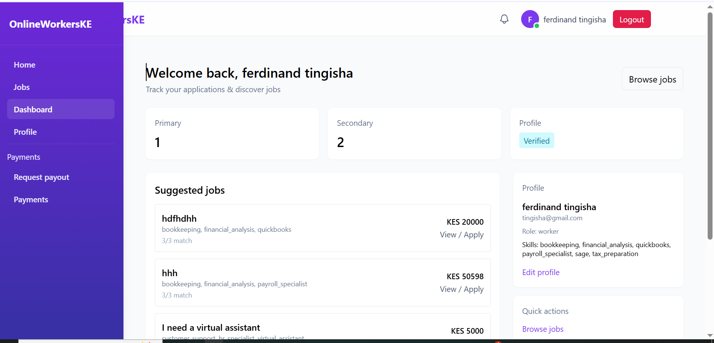
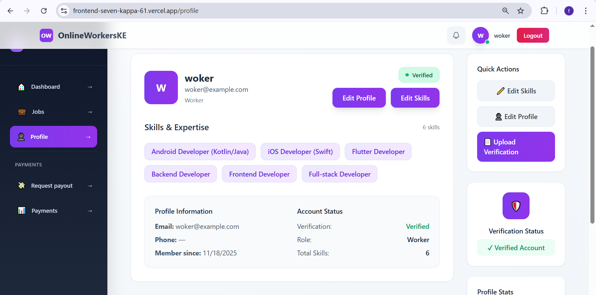
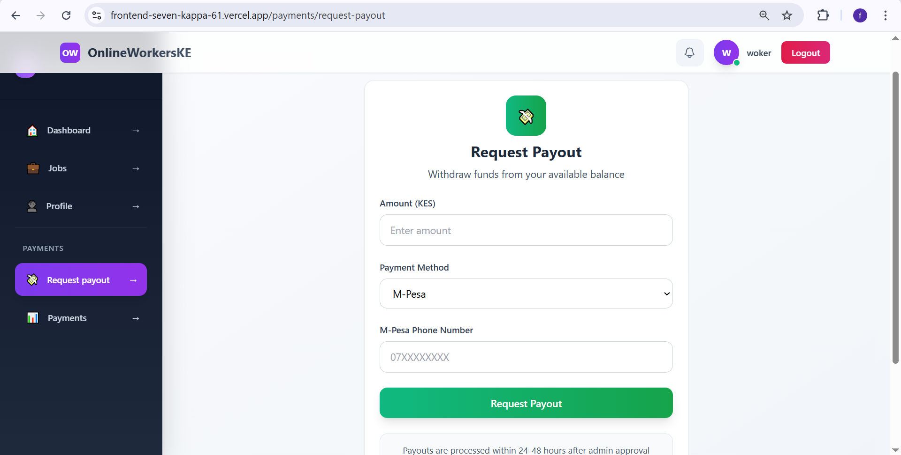

Online Workers Platform
A comprehensive platform connecting employers with freelancers for various tasks and projects, featuring secure payments via M-Pesa, real-time notifications, and escrow services.

🚀 Features
User Authentication & Profiles: Secure registration, login, and profile management with verification
Job Management: Post jobs, browse available work, apply for positions
Application System: Submit applications with proposals and track status
Payment Integration: M-Pesa integration for top-ups, payouts, and job payments
Escrow Services: Secure fund holding until job completion
Real-time Notifications: Socket.io powered notifications for updates
Review System: Rate and review completed work
Admin Panel: Administrative controls for user and payment management
File Uploads: AWS S3 integration for document and image uploads
Audit Logging: Comprehensive logging for security and compliance
🛠 Tech Stack
Backend
Runtime: Node.js
Framework: Express.js with TypeScript
Database: MongoDB with Mongoose
Authentication: JWT with bcrypt
Real-time: Socket.io
Payments: M-Pesa API integration
File Storage: AWS S3
Queue Management: BullMQ with Redis
Logging: Winston
Security: Helmet, CORS
Frontend
Framework: React with TypeScript
Build Tool: Vite
Styling: Tailwind CSS
State Management: React Context
HTTP Client: Axios
Real-time: Socket.io Client
Notifications: React Toastify
Routing: React Router DOM
📋 Prerequisites
Node.js (v18 or higher)
MongoDB
Redis
AWS S3 account (for file uploads)
M-Pesa API credentials
🚀 Installation
Clone the repository

git clone <repository-url>
cd onlineworkers
Backend Setup

cd backend
npm install
cp .env.example .env  # Configure your environment variables
npm run dev
Frontend Setup

cd ../frontend
npm install
npm run dev
📖 Usage
Start the backend server (runs on port 5000 by default)
Start the frontend development server (runs on port 5173 by default)
Access the application at http://localhost:5173
Environment Variables
Create .env files in both backend and frontend directories with the following variables:

Backend (.env)

MONGODB_URI=mongodb://localhost:27017/onlineworkers
JWT_SECRET=your-jwt-secret
PORT=5000
FRONTEND_URL=http://localhost:5173
MPESA_CONSUMER_KEY=your-mpesa-consumer-key
MPESA_CONSUMER_SECRET=your-mpesa-consumer-secret
MPESA_SHORTCODE=your-mpesa-shortcode
AWS_ACCESS_KEY_ID=your-aws-access-key
AWS_SECRET_ACCESS_KEY=your-aws-secret-key
AWS_REGION=your-aws-region
AWS_S3_BUCKET=your-s3-bucket
REDIS_URL=redis://localhost:6379
Frontend (.env)

VITE_API_URL=http://localhost:5000/api
VITE_SOCKET_URL=http://localhost:5000
📚 API Documentation
API documentation is available via OpenAPI/Swagger. Access it at:

Local: http://localhost:5000/api-docs
Deployed: [Insert deployed backend URL]/api-docs
🔗 Deployed Links
Frontend: [Insert deployed frontend URL]
Backend API: [Insert deployed backend URL]
🤝 Contributing
Fork the repository
Create a feature branch (git checkout -b feature/amazing-feature)
Commit your changes (git commit -m 'Add some amazing feature')
Push to the branch (git push origin feature/amazing-feature)
Open a Pull Request
📄 License
This project is licensed under the ISC License.

📞 Support
For support, email [tingishaferdinand] or create an issue in the repository.

📸 Screenshots

### Landing Page

### Employer Dashboard

### Employer Post Job

### Employer Profile

### Employer Top Up Escrow

### Worker Dashboard

### Worker Profile

### Worker Request Payout

