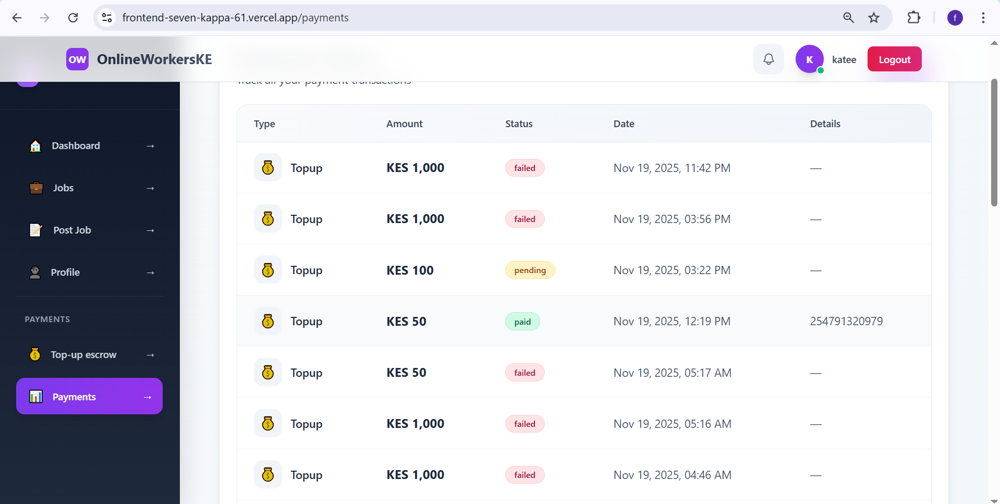

# 🌐 LIVE — Visit the deployed web

>**Frontend (live):** [https://frontend-seven-kappa-61.vercel.app](https://frontend-seven-kappa-61.vercel.app)
> **Backend API:** [https://online-wokers-ke-1.onrender.com](https://online-wokers-ke-1.onrender.com)

---

# 🧱 Online Workers Platform

A full platform connecting employers and freelancers. Features secure M-Pesa payments, escrow, real-time notifications, verification, and admin tools.

---

# 🚀 Features

* **User Authentication & Profiles** — registration, login, verification
* **Job Management** — post jobs, browse gigs, apply
* **Application System** — submit proposals and track statuses
* **Payment Integration** — M-Pesa (top-ups, payouts, job payments)
* **Escrow Services** — hold funds until job completion
* **Real-time Notifications** — Socket.io powered
* **Review System** — rate workers after job completion
* **Admin Panel** — manage users, payments, and logs
* **File Uploads** — AWS S3
* **Audit Logging** — comprehensive logs for security/compliance

---

# 🛠 Tech Stack

## Backend

* Node.js, Express (TypeScript)
* MongoDB + Mongoose
* JWT + bcrypt
* Socket.io
* M-Pesa Daraja API
* AWS S3
* BullMQ + Redis
* Winston, Helmet, CORS

## Frontend

* React + TypeScript (Vite)
* Tailwind CSS
* Axios
* React Router DOM
* Socket.io Client
* React Toastify

---

# 📋 Prerequisites

* Node.js (v18+ recommended)
* MongoDB
* Redis
* AWS S3 account (for file uploads)
* M-Pesa API credentials

---

# 🚀 Installation

### Clone repository

```bash
git clone https://github.com/ferditing/Online-Wokers-KE
cd onlineworkers
```

## Backend Setup

```bash
cd backend
npm install
cp .env.example .env  # configure environment variables
npm run dev
```

## Frontend Setup

```bash
cd ../frontend
npm install
npm run dev
```

---

# 📖 Usage

* Backend: default port **5000** (or `PORT` env)
* Frontend: default port **5173**
* Open: `http://localhost:5173`

---

# 🔐 Environment Variables

## Backend `.env` (example)

```
MONGODB_URI=your-mongo-uri
JWT_SECRET=your-jwt-secret
PORT=5000
FRONTEND_URL=http://localhost:5173

MPESA_CONSUMER_KEY=
MPESA_CONSUMER_SECRET=
MPESA_SHORTCODE=

AWS_ACCESS_KEY_ID=
AWS_SECRET_ACCESS_KEY=
AWS_REGION=
AWS_S3_BUCKET=

REDIS_URL=redis://localhost:6379
CORS_ORIGINS=http://localhost:5173,https://frontend-seven-kappa-61.vercel.app,https://frontend-pzuy83zwq-ferdinand-tingishas-projects.vercel.app
```

> **Note:** set `CORS_ORIGINS` on Render to include your Vercel frontend URL(s).

## Frontend `.env` (example)

```
VITE_API_URL=https://online-wokers-ke-1.onrender.com/api
VITE_SOCKET_URL=https://online-wokers-ke-1.onrender.com
```

---

# 📚 API Documentation

* Local: `http://localhost:5000/api-docs`
* Production: `https://online-wokers-ke-1.onrender.com/api-docs`

---

# 🔗 Deployed Links

* **Frontend:** [https://frontend-seven-kappa-61.vercel.app](https://frontend-seven-kappa-61.vercel.app)
* **Backend API:** [https://online-wokers-ke-1.onrender.com](https://online-wokers-ke-1.onrender.com)

---

# 🤝 Contributing

1. Fork the repository
2. Create a feature branch: `git checkout -b feature/my-feature`
3. Commit changes: `git commit -m "Add feature"`
4. Push and open a Pull Request

---

# 📄 License

This project is licensed under the **ISC License**.

---

# 📞 Support

For support: **[tingishaferdinand@gmail.com](mailto:tingishaferdinand@gmail.com)** or open an issue on the repository.

---

### Landing Page


### Employer Dashboard


### Employer Post Job


### Employer Profile


### Employer Top Up Escrow


### Worker Dashboard


### Worker Profile


### Worker Request Payout


### Employer Payments

`

